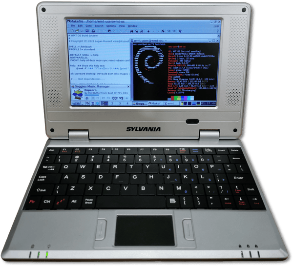

# WMT OS

WMT OS is a modern Linux distribution for netbooks built on the WonderMedia WM8505 SoC, based on Debian 13 (Trixie).

Development is focused on the Sylvania Netbook, sold for $99 [by CVS in late 2010](https://www.informationweek.com/it-leadership/cvs-offers-99-sylvania-netbook) running Windows CE 6.0. Equipped with a 300 MHz single-core 32-bit [ARM926EJ-S](https://en.wikipedia.org/wiki/ARM9#ARM9E-S_and_ARM9EJ-S) SoC (sharing the same 2001 CPU architecture as the Nintendo Wii... well, its coprocessor), 128 MB of RAM, and an 800x480 display, it was considered e-waste even when it was first released. Naturally, that makes it an excellent candidate for a modern Linux distribution today.

The same hardware shipped under plenty of other names globally. [Hardware](hardware.html) lists the models known to work.

## Getting started

Flash an image to an SD card and the netbook boots straight into WMT OS. A setup wizard on the card's boot partition configures the system prior to boot.

See [Download](download.html) for the images and [Install](install.html) for the full setup guide. Once installed, the [Handbook](handbook.html) covers using and maintaining your system.

## Recent changes

[[!inline pages="changelog/*" archive=yes show=5 feeds=no]]

[All changes](changelog.html)
