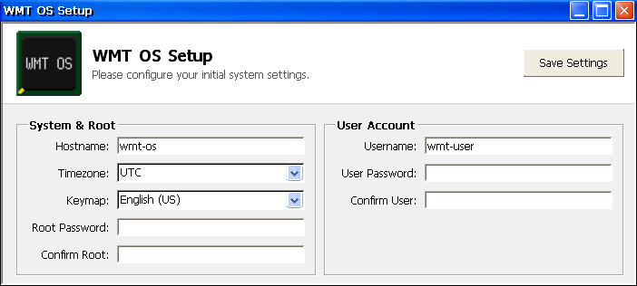

# Install

WMT OS runs entirely from an SD card, leaving the netbook's internal Windows CE installation untouched. To get started, you just need an SD card (between 4 GB and 64 GB; 8 GB+ recommended), a computer to flash it, and an image from the [Download](download.html) page.

## 1. Flash the SD card

Use your preferred imaging tool to write the OS to your card:

- **Raspberry Pi Imager:**
  - Click "CHOOSE OS", select "Use custom", and open the downloaded image.
  - Click "CHOOSE STORAGE" and select your SD card.
  - Click "NEXT". Choose "NO" for applying OS customizations, then "YES" to start flashing.
- **Command line (`dd`):**
  - Decompress the image:

        xz -d /path/to/wmt-os-<profile>-<stamp>.img.xz

  - Flash the image (replace `/dev/sdX` with your SD card):

        sudo dd if=wmt-os-<profile>-<stamp>.img of=/dev/sdX bs=1M conv=fsync

  - Eject the drive:

        sudo eject /dev/sdX

## 2. Configure the system

WMT OS runs completely unattended on first boot. It reads your desired hostname, timezone, keymap, username, and account passwords from a `setup.ini` file on the card's FAT boot partition. You can generate this file using a visual setup wizard included directly on the flashed SD card. Choose one of these three ways to run it:

- **On the netbook (from Windows CE):**
  1. Power on the netbook into Windows CE, then insert the flashed SD card.
  2. Open "My Computer", then "Storage Card".
  3. Double-click `setup`.
  4. Fill out the form and click Save to generate your `setup.ini` file.
  5. Shut down, then power back on. The netbook will boot into WMT OS.
- **On a Windows PC:** Open the card and run `setup.cmd`. The same form opens and saves `setup.ini` in place.
- **On Linux or macOS:** Open `setup-web.html` in a web browser, fill out the form, and click Save. Copy the downloaded `setup.ini` to the root of the card's boot partition.

If you skip configuration, the system falls back to these default settings:

| Setting       | Default    |
| ------------- | ---------- |
| Hostname      | `wmt-os`   |
| Root password | `root`     |
| Username      | `wmt-user` |
| User password | `wmt-user` |
| Timezone      | UTC        |
| Keymap        | `us`       |

The default user account is a sudoer. `setup.ini` is read once on first boot and then shredded since it holds plaintext passwords. If you boot using the defaults, be sure to change both passwords after logging in.

## 3. First boot

With the card inserted, power on the netbook. It will boot WMT OS automatically.

The initial boot takes several minutes. During this time, it applies your configuration, expands the root filesystem to fill the rest of the SD card, creates a 256 MB swap file, and generates SSH host keys.

Your netbook is now running WMT OS. See the [Handbook](handbook.html) for using and maintaining your system.
